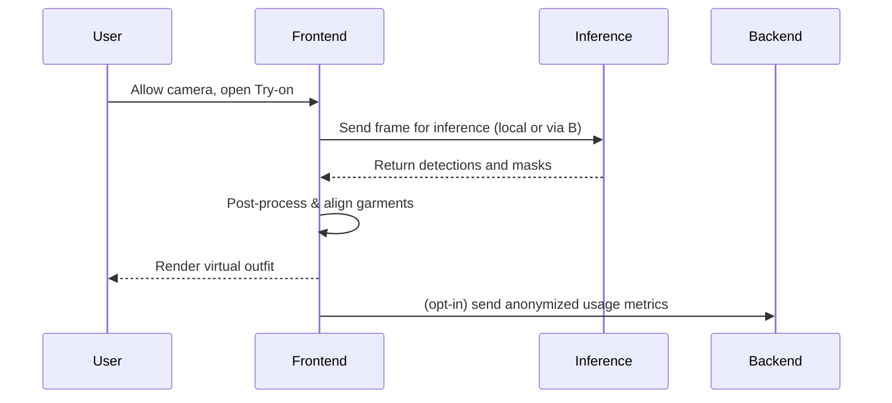

# Fashion-Mirror

A professional academic Final Year Project (FYP) implementation and release of Fashion-Mirror — an interactive fashion-assistance mirror that leverages computer vision, machine learning, and web technologies to provide real-time outfit visualization, recommendation, and analytics.

---

Badges: <!-- Replace placeholders with actual badges (build, license, version, coverage, etc.) -->
[]() []()

---

## Table of Contents

- [Abstract](#abstract)
- [New Release (Summary)](#new-release-summary)
- [Features](#features)
- [Motivation & Objectives (FYP)](#motivation--objectives-fyp)
- [Architecture & Components](#architecture--components)
  - [Conceptual Architecture Diagram](#conceptual-architecture-diagram)
  - [Component Responsibilities](#component-responsibilities)
- [System Flows & Sequence Diagrams](#system-flows--sequence-diagrams)
  - [Data Flow](#data-flow)
  - [Sequence: Live Try-on Use Case](#sequence-live-try-on-use-case)
- [Use Cases](#use-cases)
- [Getting Started](#getting-started)
  - [Prerequisites](#prerequisites)
  - [Installation](#installation)
  - [Running Locally](#running-locally)
  - [Docker](#docker)
- [Testing & Quality Assurance](#testing--quality-assurance)
  - [Automated Tests](#automated-tests)
  - [Performance & Scalability Testing](#performance--scalability-testing)
  - [User Studies & Usability Testing](#user-studies--usability-testing)
- [Dataset & Model Training](#dataset--model-training)
- [Evaluation & Results](#evaluation--results)
- [Design Decisions](#design-decisions)
- [Security & Privacy](#security--privacy)
- [Contributing](#contributing)
- [Changelog / Release Notes](#changelog--release-notes)
- [Future Work](#future-work)
- [Acknowledgements & Academic Details](#acknowledgements--academic-details)
- [License](#license)
- [Contact](#contact)
- [References](#references)

---

## Abstract

Fashion-Mirror is an academic-grade project that integrates computer vision and human-centered design to offer users an augmented mirror experience for fashion exploration. The system analyzes live video or uploaded photos to identify garments, provide fit and style recommendations, and simulate outfits on a virtual canvas. This README documents the new professional upgrade release alongside the original project, emphasizing replicability, evaluation, and future extensions appropriate for an FYP report.

---

## New Release (Summary)

This release is a combined, professional upgrade that consolidates prior experimental work into a robust, maintainable system suitable for demonstration, evaluation, and further research.

Highlights:
- Release version: v2.0.0
- Release date: 2026-07-01
- Full TypeScript codebase modernization and modularization
- Improved model inference pipeline with optimized pre-/post-processing
- Redesigned responsive UI for live and static inputs
- Dockerized development and deployment workflow
- Enhanced privacy-aware data handling and anonymized analytics
- CI/CD pipeline scaffolding and automated tests added
- Academic documentation expanded (methodology, experiments, evaluation)

For a one-line summary: This release moves Fashion-Mirror from a prototype to a professional, academically-documented system suitable for demonstration, evaluation, and future research development.

---

## Features

- Real-time garment detection and segmentation
- Garment classification into categories (e.g., shirt, pants, dress)
- Color and pattern recognition
- Virtual try-on and outfit simulation (layered canvas rendering)
- Style recommendations based on heuristic rules and learned preferences
- Analytics dashboard for usage and trend insights (privacy-preserving)
- Exportable snapshots and shareable outfit links
- Accessible UI with keyboard navigation and ARIA labels
- CLI tools for dataset preparation and model evaluation

---

## Motivation & Objectives (FYP)

Objectives of the final year project:
1. Design and implement a modular system that integrates computer vision models with an interactive frontend for fashion augmentation.
2. Evaluate the performance of garment detection and classification models against publicly available datasets and custom-curated data.
3. Assess user experience and usability through structured user studies.
4. Produce reproducible artifacts (code, data preparation scripts, trained weights, and documentation) suitable for academic evaluation.

Research questions:
- How effectively can real-time garment detection enable practical virtual try-on experiences on commodity hardware?
- What trade-offs exist between model accuracy, latency, and usability in a live interactive application?
- How can privacy-preserving techniques be applied to store only aggregated analytics while keeping individual images local?

---

## Architecture & Components

High-level components:
- Frontend (TypeScript / React): responsive UI, virtual mirror canvas, controls, and analytics dashboard.
- Backend (Node.js / TypeScript): REST/GraphQL API for optional server-side inference, model orchestration, and data management.
- Inference Engine: model wrappers for TensorFlow/ONNX/PyTorch runtime (web and server variations).
- Data Pipeline: dataset ingestion, augmentation scripts, annotation format converters, and training utilities.
- DevOps: Dockerfiles, Compose manifests, and CI workflows for automated testing and release.

### Conceptual Architecture Diagram

The repository supports documentation images and mermaid diagrams. Include the following mermaid block in the README for a quick conceptual view (GitHub supports mermaid diagrams in Markdown):

```mermaid
flowchart LR
  A[Camera / Upload] --> B[Preprocessing]
  B --> C[Inference Engine]
  C --> D[Post-processing / Rendering]
  D --> E[Virtual Mirror UI]
  E --> F[User Interaction]
  C --> G[Analytics (anonymized)]
  style A fill:#f9f,stroke:#333,stroke-width:1px
```

(If mermaid is not rendered in your environment, we also provide a PNG/SVG in /docs/diagrams when you add images.)

### Component Responsibilities
- Frontend
  - Capture camera frames or load images
  - Run on-device inference (where supported) or call backend endpoints
  - Render virtual try-on layers with correct occlusion and alignment
  - Manage user preferences and local storage (privacy-first)
- Backend
  - Provide heavier inference endpoints and model lifecycle management
  - Host analytics ingestion (aggregated only)
  - Serve static assets and model binaries when needed
- Inference Engine
  - Wraps model runtimes (ONNX/TF.js/PyTorch) with consistent pre/post-processing
  - Exposes lightweight APIs for detection, segmentation, and attribute prediction
- Data Pipeline
  - Converts annotations to COCO-style, runs augmentations, and prepares TF/PyTorch datasets

---

## System Flows & Sequence Diagrams

### Data Flow

A high-level data flow shows how data moves through the system:

```mermaid
flowchart TD
  subgraph Client
    camera(Camera)
    ui(UI)
  end
  camera --> ui
  ui --> preprocess[Preprocessing / Resize]
  preprocess --> infer[Inference (ONNX/TF.js)]
  infer --> post[Post-processing (nms, mask cleanup)]
  post --> render[Render on Canvas]
  render --> user[User Interaction]
  infer --> analytics[Send anonymized metrics]
```

### Sequence: Live Try-on Use Case



---

## Use Cases

Primary actors: End User, Researcher/Developer, Administrator.

1. Live Try-on (End User)
   - Preconditions: User has a device with a camera and a modern browser.
   - Flow: Allow camera -> select garments -> system detects garments -> virtual try-on renders -> user captures snapshot.
   - Postconditions: Snapshot saved locally or shared; analytics recorded (anonymized).

2. Offline Photo Try-on (End User)
   - Preconditions: User uploads a photo.
   - Flow: Upload -> preprocessing -> inference -> render -> user adjusts overlay.

3. Model Training & Evaluation (Researcher)
   - Preconditions: Prepared training dataset and configuration.
   - Flow: Run prepare-dataset -> run training -> export checkpoints -> run evaluation scripts.

4. System Administration (Administrator)
   - Flow: Deploy containers -> monitor CI/CD -> rotate model artifacts -> manage access.

Use case diagrams can be added to /docs/diagrams/usecases.png (placeholder) or represented as mermaid usecase diagrams when required.

---

## Getting Started

### Prerequisites

- Node.js >= 18.x
- npm or pnpm
- Docker (optional but recommended)
- Modern browser for web client (Chrome/Edge/Firefox)
- Git

### Installation (development)

1. Clone the repo:
   git clone https://github.com/romanahmad-dev/Fashion-Mirror.git
   cd Fashion-Mirror

2. Install dependencies:
   npm install
   # or
   pnpm install

3. Build:
   npm run build

### Running Locally (frontend + backend)

- Development mode (frontend):
  npm run dev:frontend

- Development mode (backend):
  npm run dev:backend

- Full stack:
  npm run dev

See package.json for exact script names; scripts may include start, build, test, lint, and format.

### Docker

Build and run using Docker Compose:
- Build:
  docker-compose build
- Run:
  docker-compose up

This launches the backend and a static frontend container. Check docker-compose.yml for service names and ports.

---

## Testing & Quality Assurance

A robust QA plan is included to support the FYP evaluation criteria: unit tests, integration tests, end-to-end tests, performance benchmarks, and user studies.

### Automated Tests

- Unit tests (Jest / Vitest): test utilities, model wrappers, and UI components.
  - Run: npm run test:unit
- Integration tests: API endpoints, model inference wrapper integration.
  - Run: npm run test:integration
- End-to-end tests (Playwright / Cypress): simulate user workflows (try-on, upload, snapshot, settings).
  - Run: npm run test:e2e
- Static analysis: ESLint and TypeScript type checks
  - Run: npm run lint && npm run typecheck

Test coverage and badges should be added to the README when CI is configured.

### Performance & Scalability Testing

- Latency benchmarking: measure inference time per frame (ms) on target hardware (desktop, laptop, mobile CPU).
- Throughput testing: for server-side inference, measure requests/sec and resource utilization under synthetic load (wrk, k6).
- Memory profiling: track memory usage in browser and backend processes.

Suggested benchmark commands (examples):
- Browser inference latency: run a test harness that captures N frames and records per-frame latency (script in /bench)
- Server load: k6 run --vus 50 --duration 1m loadtest/infer.js

### User Studies & Usability Testing

- Prepare IRB-approved materials: consent forms, participant information sheet, demographic questionnaire.
- Conduct tasks: ask participants to complete typical flows (try-on, adjust overlay, save snapshot) and collect SUS (System Usability Scale) scores.
- Qualitative feedback: record sessions (with consent), transcribe, and code for recurring themes.

Record and summarize findings in the FYP write-up and include anonymized logs where appropriate.

---

## Dataset & Model Training

Dataset:
- The project supports both public datasets and custom-collected data. Typical public datasets used for benchmarking:
  - DeepFashion (bounding box & attribute annotations)
  - ModaNet (segmentation annotations)
- Collected dataset: describe collection protocol (camera settings, subject diversity, consent forms). Ensure ethical clearance for human-subject data where applicable.

Annotation format:
- COCO-style JSON for bounding boxes and segmentation
- Label schema defined in /data/labels.yml

Training pipeline:
- Data augmentation: color jitter, affine transforms, random occlusion
- Backbone: mobile-optimized architecture (e.g., MobileNet / EfficientNet-lite) for real-time inference
- Loss functions: cross-entropy for classification, dice/IoU for segmentation
- Evaluation metrics: mAP for detection, mean IoU for segmentation, accuracy for classification, latency (ms) on target hardware

Reproducibility:
- All training configs live in /configs with explicit seeds and environment documentation.
- We recommend using containerized training to avoid dependency drift.

---

## Evaluation & Results

Key evaluation artifacts to include in the FYP deliverables:
- Quantitative metrics (tables/plots): precision, recall, F1, mAP, mIoU, latency, model size
- Qualitative results: sample visualizations for detection & segmentation results
- User study summary: participant demographics, tasks, usability scores (e.g., SUS), key findings

Example summary (placeholder):
- Detection mAP@0.5: 0.78
- Segmentation mIoU: 0.71
- Average inference latency (browser, CPU): 120 ms
- System usability score (SUS): 82

Replace placeholders above with actual experiment outputs in the FYP write-up.

---

## Design Decisions

- TypeScript-first codebase: improved maintainability and stricter typing for large-scale academic projects.
- Modular architecture: separates inference, UI, and data pipelines to ease reproducibility and extension.
- Favor on-device inference: prioritizes user privacy and reduces backend costs while providing acceptable latency.
- Accessibility: semantic HTML, keyboard navigation, high-contrast mode.

---

## Security & Privacy

- By default, images and camera streams are processed client-side; uploads are opt-in only.
- Stored analytics are aggregated and anonymized; no personally identifiable images are retained unless explicitly permitted.
- For deployments that accept uploads, ensure transport encryption (HTTPS) and authenticated access.
- Follow institutional data governance and ethical approval procedures for user studies.

---

## Contributing

Contributions are welcome. Please follow these steps:
1. Fork the repository.
2. Create a feature branch: git checkout -b feat/your-feature
3. Make changes and add tests.
4. Run linters and tests: npm run lint && npm test
5. Submit a pull request describing your changes and rationale.

Development guidelines:
- Follow the TypeScript coding style defined in .eslintrc and tsconfig.
- Add unit and integration tests for new features.
- Document API changes in the README and update CHANGELOG.md.

---

## Changelog / Release Notes

v2.0.0 — Professional Upgrade (2026-07-01)
- Migrated entire codebase to TypeScript with stricter types and modular structure.
- Redesigned frontend with responsive virtual mirror and accessibility improvements.
- Optimized inference pipeline for browser and server runtimes; introduced ONNX runtime support.
- Added Docker and CI configuration for reproducible builds and tests.
- Improved dataset handling and data-augmentation strategies; included scripts for reproducibility.
- Expanded documentation for academic evaluation, including dataset, training, and experimental protocols.

(Keep a complete chronological changelog in CHANGELOG.md for future releases.)

---

## Future Work

Planned improvements and research directions:
- Integration with advanced neural rendering for more realistic virtual try-on.
- Personalization: modeling user preferences with privacy-preserving federated learning.
- Real-world deployment and detailed user studies across diverse demographics.
- Mobile-first optimization for reduced latency on low-power devices.
- Automated benchmarking on standard edge hardware (Raspberry Pi, Jetson Nano).

---

## Acknowledgements & Academic Details

- Student: Roman Ahmad Khan
- Program: Bachelor of Science / Bachelor of Engineering — Computer Science
- University: Government College University Faisalabad (GCUF)
- Supervisor: Dr. Muhammad Umer Sarwar — https://profiles.gcuf.edu.pk/profile/drmuhammadumersarwar
- Group members: M. Danish, Zakir Hussain
- Examination committee: [Add members if required]

This project was carried out as part of the requirements for the Final Year Project (FYP). All research involving human participants was conducted under the relevant institutional review board (IRB) approvals (include approval ID here).

---

## License

This project is licensed under the MIT License. See LICENSE file for details.

---

## Contact

For questions, feedback, or collaboration:
- Repository: https://github.com/romanahmad-dev/Fashion-Mirror
- Student: Roman Ahmad Khan — https://github.com/romanahmad-dev
- Email: your.email@university.edu (replace with preferred contact)

---

## References

- Zheng, Z., et al. "DeepFashion: Powering Robust Clothes Recognition and Retrieval." (cite properly)
- Li, Y., et al. "ModaNet: A Large-Scale Street Fashion Dataset with Polygon Annotations." (cite properly)
- Relevant model and dataset links (add DOIs or URLs)
